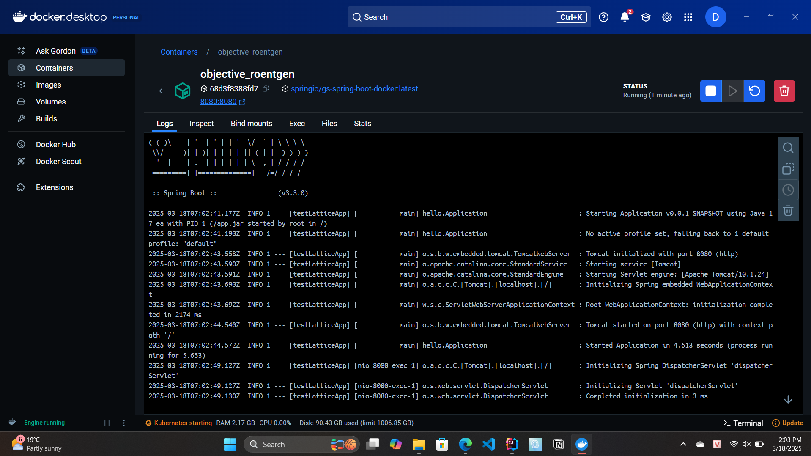
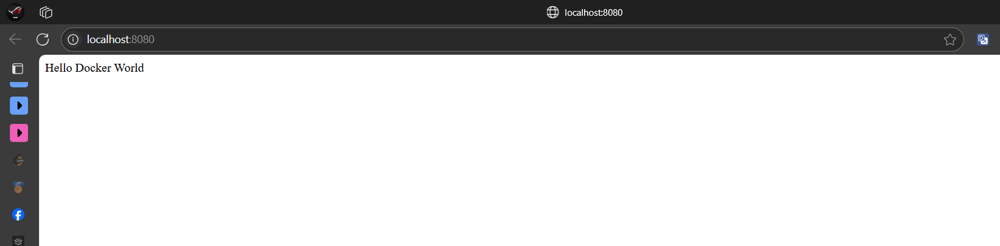

# Link bài Spring On Kubernetes:
https://github.com/DatPhan06/top-spring-on-kubernetes

# Spring Boot với Docker

Đây là bài tập thực hành về việc containerize ứng dụng Spring Boot sử dụng Docker.

## Mục tiêu
- Tạo một ứng dụng Spring Boot đơn giản
- Containerize ứng dụng sử dụng Docker
- Chạy và kiểm tra ứng dụng trong container

## Công nghệ sử dụng
- Java 17
- Spring Boot
- Docker
- Maven/Gradle

## Các bước thực hiện

### 1. Tạo ứng dụng Spring Boot
- Sử dụng Spring Initializr để tạo project
- Thêm dependency Spring Web
- Tạo một REST controller đơn giản trả về "Hello Docker World"

### 2. Containerize với Docker
- Tạo Dockerfile với các layer tối ưu
- Build Docker image
- Chạy container và kiểm tra ứng dụng

### 3. Kết quả
Ứng dụng đã được containerize thành công và có thể chạy trong Docker container.

## Demo



## Hướng dẫn chạy

### Build ứng dụng
```bash
./mvnw package
```

### Build Docker image
```bash
docker build -t springio/gs-spring-boot-docker .
```

### Chạy container
```bash
docker run -p 8080:8080 springio/gs-spring-boot-docker
```

Sau khi chạy, truy cập http://localhost:8080 để xem kết quả.
 

# Link bài Spring On Kubernetes:
https://github.com/DatPhan06/top-spring-on-kubernetes